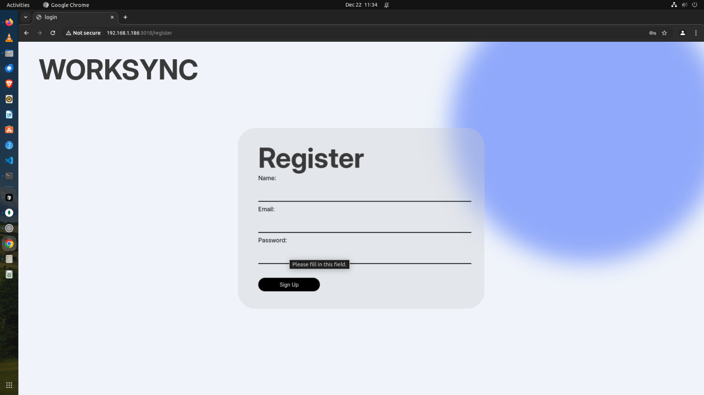
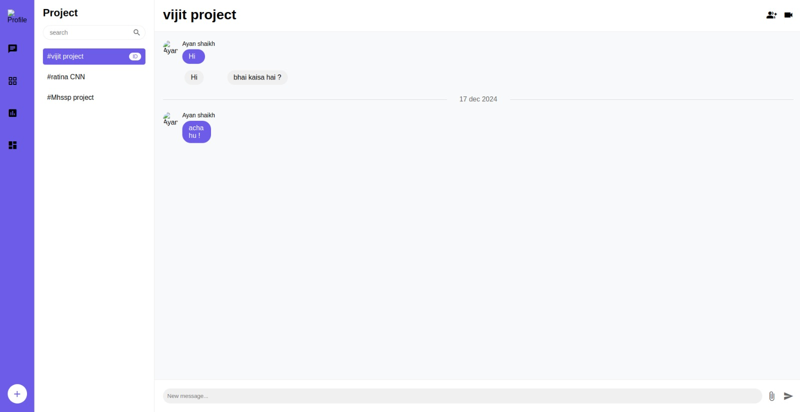

# WorkSync

WorkSync is a web-based platform designed to revolutionize remote work by addressing the challenges of collaboration, productivity, and team cohesion. In a world where remote work has become the norm, WorkSync integrates essential tools into a single cohesive solution, enabling teams to work efficiently, maintain clear communication, and foster a strong sense of unity—no matter where they are.


## Team members


**[Team Leader - Affan Shaikh](https://github.com/MohammedAffanShaikh)**
-
- Email - shaikhmohammadaffaninayat@gmail.com

**[Ayan Shaikh](https://github.com/ayan4955G/)**
-
- Email - ayanshaikhdev@gmail.com
- [Leetcode](https://leetcode.com/u/THE_ayanshaikh_/)

**[Amir Shaikh](https://github.com/amir-200)**
-
- Email - shaikhamir2888@gmail.com 

**[Mohammad Anas](https://github.com/MohammadAnas45)**
-
- Email - anascodesss@gmail.com


## PPT
[PPT hosted here](https://bluetoorh-voice-control-car.my.canva.site/worksync)

## 🌐 Overveiw
With the rise of remote work, maintaining effective communication, managing workflows, and fostering team cohesion have become major challenges for teams worldwide. WorkSync addresses these challenges by providing an all-in-one platform designed to make remote collaboration effortless and productive.

Whether you're managing tasks, conducting meetings, editing documents in real time, or engaging in team-building activities, WorkSync integrates all these tools into a single, cohesive solution. Featuring an exceptional user interface and an optional VR workspace, WorkSync enhances productivity, streamlines workflows, and brings remote teams closer together.

By minimizing tool-switching fatigue and fostering a collaborative environment, WorkSync enables teams to focus on what matters most—achieving their goals, no matter where they are.

## 🚀  Key features
- Exceptional User Interface: A clean, intuitive, and user-friendly UI designed to make collaboration effortless.
- Project Management Tools: Organize tasks, track progress, and manage deadlines - effectively.
- Integrated Video Conferencing: Seamless built-in or integrated video calls for uninterrupted communication.
- Real-Time Document Editing: Collaborate on shared documents with live updates for efficient teamwork.
- Team-Building Activities: Engage in games, quizzes, and activities to build morale and strengthen relationships.
- Customizable Dashboards: Tailor your workspace with personalized team dashboards to suit your projects and goals.

## 🎯 Why WorkSync

1. Seamless Collaboration: All the tools remote teams need in one place.
2. Boosted Productivity: Minimize time wasted switching between platforms with an integrated workflow.
3. Foster Team Unity: Strengthen bonds and morale with interactive activities.
4. Enhanced Presence: Innovate with VR technology, bringing a near-physical work experience to remote teams.
5. Exceptional Design: A visually appealing UI that enhances usability and productivity.

## 🖼️ Screenshots  

Here are some snapshots of the **WorkSync** platform's exceptional UI and it's userflow:

### Uerflow  
  
*Streamlined navigation ensuring a seamless experience from onboarding to daily use.*  

### Landing Page  
  
*Secure and user-friendly login interface for quick access to your workspace.*  

### Login Page  
  
*Secure and user-friendly login interface for quick access to your workspace.*  

### Registration Page  
  
*Efficiently manage tasks, deadlines, and progress in a streamlined interface.*

### Upload Page  
  
*Easily upload files and documents to share with your team in real time.*

### Dashboard  
  
*An intuitive hub for tracking projects, tasks, and communication in one place.*

### Group Chat   
  
*Collaborate effortlessly with your team through real-time group messaging, enabling dynamic discussions and instant updates.*

### Screen Sharing  
[![Showcasing the screen sharing here]](https://youtu.be/yeKvhTcaanU?si=0gjmv7mHOTaivX7-)  
*Collaborate on documents in real time with live updates.*  


## 🛠️ Installation  

1. **Clone the Repository**:  
   ```bash
   git clone https://github.com/yourusername/worksync.git
   cd worksync
   ```

2. **Install Dependencies**:  
   ```bash
   npm install
   ```

3. **Run the Application**:  
   ```bash
   npm start
   ```

4. Open your browser and navigate to:  
   ```bash
   http://localhost:3000
   ```

---
## Demo

Insert gif or link to demo

